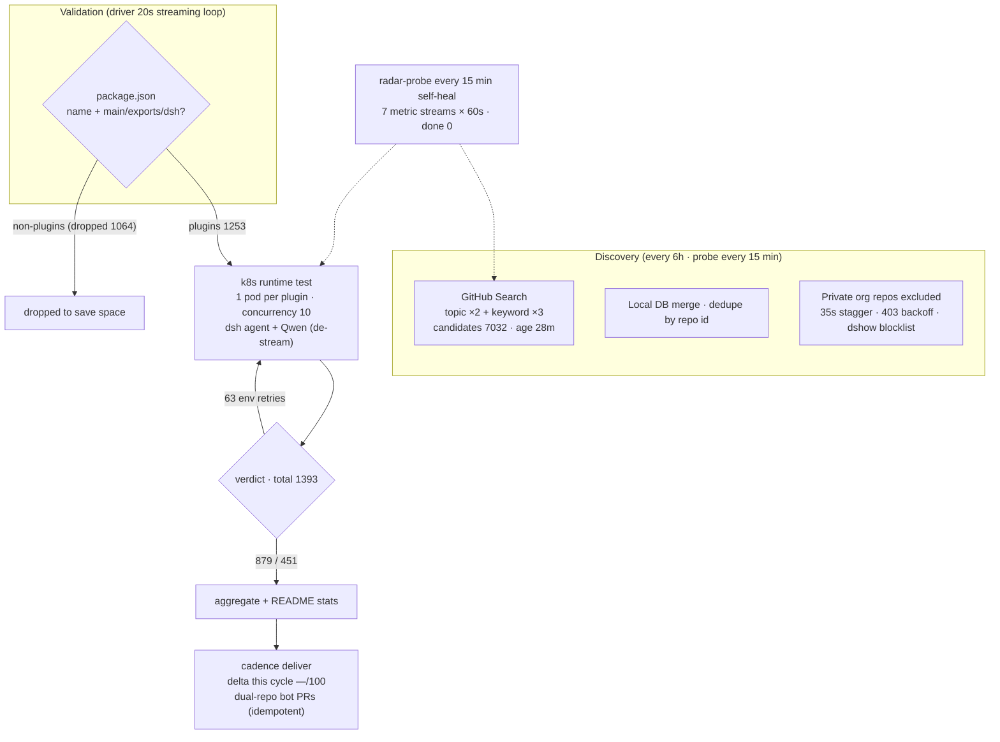

# Awesome DSH Plugins

   
  

**A daily-updated radar that auto-discovers and compatibility-tests every plugin for DeepSeek Harness.**
Know which plugins work before you install them.

   

   

[English](README.en-US.md) | [简体中文](README.md)

---

**What is this?** DeepSeek Harness (DSH) is an open-source coding agent where everything is a plugin. This repo is a **radar** that automatically tracks its plugin ecosystem — **1253 plugin repos indexed** (clone-verified package.json), **1393 runtime-tested on the k8s track**.

## How it works

<!-- AUTO:pipeline:START -->

<!-- AUTO:pipeline:END -->

## Quick Start

| Goal | Link |
|---|---|
| Browse featured plugins | [Featured Top 50](#featured-top-50) — curated · 11 categories |
| Find a plugin by use case | [Plugin Catalog](#plugin-catalog) — 13 categories · per-plugin details in [PLUGINS-ALL.md](PLUGINS-ALL.md); [PLUGINS.md](PLUGINS.md) is the PR-registered list |
| Browse all auto-discovered repos | [ Ecosystem Snapshot](#ecosystem-snapshot) — dated compatibility matrix |
| See what changed recently | [ CHANGELOG](CHANGELOG.md) |
| Register or submit a plugin | [ For Plugin Developers](#for-plugin-developers) · add the `dsh-plugin` topic → discovered within 8h · [PR template](.github/PULL_REQUEST_TEMPLATE.md) |
| Maintain this radar | [ Automation SOP](docs/SOP.md) |
| Plugin user guide | [ For Plugin Users](#for-plugin-users) |
| How we assess compatibility | [ How We Assess Compatibility](#how-we-assess-compatibility) |
| Join the community | [ dshfind.com](#dsh-learning-community-dshfindcom) · [Discussion group](#community-discussion-group) |

> [!IMPORTANT]
> **Inclusion ≠ compatible, static check ≠ runtime-usable, runtime-usable ≠ security-audited.**
> This repo provides traceable filtering signals, not official DSH endorsement. Always review plugin source, permissions, dependencies, and license before installing.

## Featured Top 50

<!-- AUTO:featured:START -->

> 人工策展 50 个高价值插件，按 11 类分组、类内按星标排序；星标每 6 小时自动刷新（成员调整请提 PR 修改 data/awesome-50.json）。数据截至 2026-08-25 21:23（UTC+8）。

### 🚀 智力增强 Booster（6）

| 插件 | ⭐ | 实测 | 说明 |
|---|---:|---|---|
| [dsh-routing-suite](https://github.com/yjh051108/dsh-routing-suite) | 6795 | — | 注入器 × 思维模式路由套装：免重启运行时注入器 + 任务感知推理模式路由预设（P1-P23 实测） |
| [harmony-next.skills](https://github.com/linhay/harmony-next.skills) | 338 | ✅ | 技能驱动的工作流增强 |
| [superpowers-dsh](https://github.com/LayneChai/superpowers-dsh) | 93 | ✅ | TDD/调试/计划等开发技能集 |
| [forkprobe](https://github.com/Jayden-X-L/forkprobe) | 70 | ✅ | 同一任务跑多个技能对比，自动选优 |
| [dsh-tool-turbo](https://github.com/Electricitysheep/dsh-tool-turbo) | 7 | ✅ | 按轮次自动优化 reasoning_effort（推理力度） |
| [dsh-reasoning-settings](https://github.com/JuneLearn/dsh-reasoning-settings) | 6 | ✅ | 推理设置控制：让模型按任务切换思考档位 |

### 🖥 界面与工作台（7）

| 插件 | ⭐ | 实测 | 说明 |
|---|---:|---|---|
| [dsh-web-ui](https://github.com/zhu1090093659/dsh-web-ui) | 6031 | ✅ | Web UI 增强与皮肤合集：任务看板、Git 图、移动端、皮肤中心 |
| [DSH-better-sidebar](https://github.com/omdsh-dev/DSH-better-sidebar) | 2873 | ✅ | 侧边栏变完整工作台：文件编辑/终端/Git/子代理，支持三方注册扩展页 |
| [dsh-genui](https://github.com/omdsh-dev/dsh-genui) | 333 | ✅ | GenUI 内联组件：图表/表单/测验/3D 场景 + action 事件环 |
| [dsh-visualize](https://github.com/Nagi-ovo/dsh-visualize) | 214 | ✅ | 对话中生成交互式可视化卡片 |
| [dsh-annotation](https://github.com/omdsh-dev/dsh-annotation) | 98 | ✅ | 划选文字→批注→随消息发送，回复逐条对照 |
| [Liang-Saint-Slider](https://github.com/BruzWJ/Liang-Saint-Slider) | 94 | ✅ | 模型与思考力度选择滑条 |
| [dsh-navbar](https://github.com/vlln/dsh-navbar) | 58 | ✅ | 对话节点导航条：右缘节点串快速跳转（官方 bundle 插件） |

### ⌨️ 终端与桌面端（5）

| 插件 | ⭐ | 实测 | 说明 |
|---|---:|---|---|
| [dsh-TUI](https://github.com/ccch1mneyyy/dsh-TUI) | 2530 | ✅ | Claude Code 风全屏 TUI：鲸鱼顶栏/流式思考/双击 Esc 回滚 |
| [deepseek-harness-desktop](https://github.com/hairyf/deepseek-harness-desktop) | 1154 | ✅ | Tauri 桌面版：5MB 安装包零环境配置，Win/macOS/Linux |
| [Bigfish](https://github.com/turtle2209/Bigfish) | 301 | 未测 | 第三方桌面端：内置 Node 运行时，双击即用 |
| [oh-dsh](https://github.com/hust-open-atom-club/oh-dsh) | 277 | ✅ | 社区发行版：桌面/Web/TUI 三形态统一体验 |
| [dsh-tianshu-tui](https://github.com/huiliyi37/dsh-tianshu-tui) | 234 | 待定 | 自研 ANSI 渲染的极简终端 UI |

### 👁 视觉与多模态（3）

| 插件 | ⭐ | 实测 | 说明 |
|---|---:|---|---|
| [modlens](https://github.com/liustack/modlens) | 3648 | ✅ | 生态第一个视觉插件，视觉工作流的基准方案 |
| [dsh-vision-router](https://github.com/ysr666/dsh-vision-router) | 972 | ✅ | 内置免费视觉模型路由，给文本 agent 装眼睛 |
| [dsh-vision-toolkit](https://github.com/Anionex/dsh-vision-toolkit) | 821 | 需适配 | 带意图图片问答、长截图 OCR、UI 还原 |

### 🤖 Agent 能力与编排（6）

| 插件 | ⭐ | 实测 | 说明 |
|---|---:|---|---|
| [dsh-agent-teams](https://github.com/NanmiCoder/dsh-agent-teams) | 991 | 待定 | 多代理团队编排 |
| [helloagents](https://github.com/hellowind777/helloagents) | 698 | ✅ | agent 能力合集 |
| [sandbase-harness](https://github.com/sandbaseai/sandbase-harness) | 633 | ✅ | CMA 兼容开源 agent 运行时，任意模型可驱动 |
| [rea](https://github.com/morluto/rea) | 373 | ✅ | 用 agent 逆向工程任何东西：从应用行为到原生二进制 |
| [open-record-replay](https://github.com/humblebanana/open-record-replay) | 141 | ✅ | macOS 录制回放：把鼠标/键盘/UI 事件存为结构化轨迹供 agent 学习重放 |
| [axern](https://github.com/cofy-x/axern) | 58 | ✅ | AI agent 开源沙箱：不可信代码执行与持久服务 |

### 💻 编码与生产力（4）

| 插件 | ⭐ | 实测 | 说明 |
|---|---:|---|---|
| [TokenTracker](https://github.com/xiufengsun/TokenTracker) | 1416 | 未测 | 本地优先的 31 种编码工具 token 用量与成本追踪 |
| [dsh-at-file](https://github.com/omdsh-dev/dsh-at-file) | 474 | 需适配 | Codex 风格 @file 引用：搜索并挂载工作区文件 |
| [claude-paper](https://github.com/alaliqing/claude-paper) | 327 | ✅ | 跨 agent 论文工具箱：速读摘要/深度研读材料/代码演示 + 本地 Web 阅读器 |
| [mobius](https://github.com/nutshellai-tech/mobius) | 286 | ✅ | 编码增强 |

### 🧠 记忆与上下文（2）

| 插件 | ⭐ | 实测 | 说明 |
|---|---:|---|---|
| [mnemon](https://github.com/mnemon-dev/mnemon) | 521 | ✅ | 跨 agent、本地优先的持久记忆 |
| [dsh-memory-evolve](https://github.com/csyangwen/dsh-memory-evolve) | 246 | ✅ | 五轨记忆 + git 分支托管 + 后台自我进化 |

### 📡 消息通讯与 IM（4）

| 插件 | ⭐ | 实测 | 说明 |
|---|---:|---|---|
| [dsh-lark](https://github.com/omdsh-dev/dsh-lark) | 46 | ✅ | 飞书 IM bot 频道（官方渠道插件） |
| [dsh-message-edit](https://github.com/Moeblack/dsh-message-edit) | 43 | ✅ | 分支式消息编辑、reroll、重试、多版本 |
| [dsh-interconnect](https://github.com/Chinesezjc/dsh-interconnect) | 34 | 待定 | 跨 DSH 实例消息/事件交接 |
| [ChatCCC](https://github.com/wzj998/ChatCCC) | 22 | ✅ | 飞书/微信聊天控制 DSH / Claude Code |

### 🗂 文件、数据与浏览（4）

| 插件 | ⭐ | 实测 | 说明 |
|---|---:|---|---|
| [dsh-browser](https://github.com/Lum1104/dsh-browser) | 450 | 需适配 | Chrome 侧栏扩展，让 DSH 直接操作浏览器 |
| [dsh-openpencil](https://github.com/ZSeven-W/dsh-openpencil) | 153 | ✅ | OpenPencil 设计稿预览与编辑 |
| [dsh-web-search-pro](https://github.com/anweat/dsh-web-search-pro) | 43 | ✅ | 增强型持久网页搜索 |
| [dsh-plugin-mineru](https://github.com/HuanLinOTO/dsh-plugin-mineru) | 41 | 待定 | PDF/图片/Office 转结构化 Markdown |

### 🛒 市场与管理（4）

| 插件 | ⭐ | 实测 | 说明 |
|---|---:|---|---|
| [dsh-market](https://github.com/dsh-market/dsh-market) | 2340 | ✅ | 持续收录 1000+ 插件的市场：中文搜索 + 五维评分 |
| [dsh-web-plugin-manager](https://github.com/LX2000WASD/dsh-web-plugin-manager) | 67 | ✅ | Web UI 一键管理插件：启停/装卸/环境管理 |
| [dsh-plugin-check](https://github.com/omdsh-dev/dsh-plugin-check) | 27 | ✅ | 插件健康检查：清单协议/patch 格式/构建陷阱 |
| [deepseek-plugin-store](https://github.com/Ericwong5021/deepseek-plugin-store) | 24 | ✅ | 独立社区插件商店：发现/安装/提交经验证的插件 |

### 🎮 娱乐生活（5）

| 插件 | ⭐ | 实测 | 说明 |
|---|---:|---|---|
| [petdex](https://github.com/crafter-station/petdex) | 3974 | ✅ | 生态最高星桌宠图鉴 |
| [dsh-deep-whale](https://github.com/Small-tailqwq/dsh-deep-whale) | 1703 | 待定 | 深海鲸鱼养成 |
| [dsh-ads](https://github.com/Nagi-ovo/dsh-ads) | 566 | ✅ | 把 DSH 变回 2005 门户网站：怀旧广告/小游戏/弹窗 |
| [whale-girl](https://github.com/vlln/whale-girl) | 282 | ✅ | QQ 宠物形态桌宠：可拖拽/投喂/玩耍 |
| [dsh-kun-like-pet](https://github.com/liyupi/dsh-kun-like-pet) | 84 | ✅ | 小坤桌宠：随 Agent 工作状态切换 9 种动作 |

> 实测 = 雷达 k8s 运行级判定（✅ 可用 · 待定重测中 · 需适配 = 当前 mainline 不兼容 · 未测），逐轮判定以 [PLUGINS-ALL.md](PLUGINS-ALL.md) 为准；Booster 类按功能稀缺性豁免星标门槛；安装第三方插件前请审查源码并固定 commit。

<!-- AUTO:featured:END -->

## Plugin Catalog

<!-- AUTO:catalog:START -->

Per-plugin details (verdict · location · stars) in **PLUGINS-ALL.md**.

- **🎓 技能包**（18）— OK 14 · incompatible 3 · pending 1 · untested 0 · watching 0 — [details](PLUGINS-ALL.md#-技能包18)
- **🧠 记忆增强**（20）— OK 10 · incompatible 7 · pending 3 · untested 0 · watching 0 — [details](PLUGINS-ALL.md#-记忆增强20)
- **🎨 主题皮肤**（8）— OK 4 · incompatible 0 · pending 3 · untested 1 · watching 0 — [details](PLUGINS-ALL.md#-主题皮肤8)
- **🛒 市场与管理**（41）— OK 28 · incompatible 8 · pending 2 · untested 1 · watching 2 — [details](PLUGINS-ALL.md#-市场与管理41)
- **🔌 Web UI 增强**（231）— OK 148 · incompatible 37 · pending 19 · untested 13 · watching 14 — [details](PLUGINS-ALL.md#-web-ui-增强231)
- **💻 编码开发**（253）— OK 133 · incompatible 39 · pending 26 · untested 26 · watching 29 — [details](PLUGINS-ALL.md#-编码开发253)
- **🤖 Agent 能力**（242）— OK 134 · incompatible 42 · pending 22 · untested 19 · watching 25 — [details](PLUGINS-ALL.md#-agent-能力242)
- **📡 消息通讯**（93）— OK 49 · incompatible 17 · pending 14 · untested 8 · watching 5 — [details](PLUGINS-ALL.md#-消息通讯93)
- **🗂 文件数据**（77）— OK 39 · incompatible 19 · pending 8 · untested 4 · watching 7 — [details](PLUGINS-ALL.md#-文件数据77)
- **🎮 娱乐生活**（50）— OK 31 · incompatible 6 · pending 5 · untested 2 · watching 6 — [details](PLUGINS-ALL.md#-娱乐生活50)
- **🛠 基建部署**（213）— OK 101 · incompatible 65 · pending 15 · untested 6 · watching 26 — [details](PLUGINS-ALL.md#-基建部署213)
- **📚 学习研究**（18）— OK 7 · incompatible 5 · pending 1 · untested 3 · watching 2 — [details](PLUGINS-ALL.md#-学习研究18)
- **❓ 其他**（625）— OK 333 · incompatible 123 · pending 33 · untested 45 · watching 91 — [details](PLUGINS-ALL.md#-其他625)

<!-- AUTO:catalog:END -->

##  DSH Learning Community dshfind.com

[dshfind.com](https://dshfind.com) — Learn DSH principles, discover plugins & share best practices.

[ dshfind.com](https://dshfind.com) · [GitHub](https://github.com/hikariming/dshfind)

## Community Discussion Group

The DSH plugin community discussion group on WeChat: plugin authors, maintainers, and users discuss plugin development, compatibility issues, and new releases.

> The QR code is valid for 7 days (before 2026-08-21).

## For Plugin Users

### 1. Find candidate plugins

- Browse the [Plugin Catalog](#plugin-catalog) first, with per-plugin details in [PLUGINS-ALL.md](PLUGINS-ALL.md) — the auto-discovered, runtime-tested full listing (verdict · location · stars per entry).
- [PLUGINS.md](PLUGINS.md) is the PR-registered community list (manual descriptions + reported runtime results); it complements the auto-discovered catalog.
- If both miss it, search the repo name or keywords in the dated [Ecosystem Snapshot](#ecosystem-snapshot) index.
- Treat repos that are inaccessible, lack a README or license, or sit unmaintained as high-risk candidates — not "verified plugins".

### 2. Understand status (unified 4-tier scale)

All entries use a **single runtime scale** (k8s container tests — see the test version note below). The four tiers are mutually exclusive:

| Status | What it says | What it does not say |
|---|---|---|
|  Runtime OK | Actually loaded and completed the verification task under the recorded test version | Not a full functional, performance, or security test |
|  Runtime incompatible | Hard failure — missing deps, read-only sandbox, missing internal packages (3 retries all failed) | Not permanently unusable; the author may have fixed it in a newer version |
|  Pending | Test-environment failure; the verdict is incomplete | **Not partially compatible** — awaiting a retest |
| · Untested | Never dispatched to a runtime test | Do not infer either compatibility or incompatibility |

> [!NOTE]
> **Test version**: dsh (in-container agent) driven by Qwen3.6-35B (via the de-stream proxy) · k8s, 5 shards · each run is anchored by the snapshot `run_id` (currently `20260816T183001Z`). The DSH npm version is not recorded per snapshot — cross-check via run_id and the `reports/agent-test/` dates.
> **Scale note**: "tested N" in badges and stats is the single-run scale; the catalog and full listing use the cross-run cumulative scale — the numbers legitimately differ.

Every conclusion carries four facts: **plugin commit, mainline commit, test date, test level**. If any one is missing, lower your trust in the result.

### 3. Install, verify, and roll back

This catalog is not a package manager and ships no install command verified by this repo. Follow the plugin's own README, ideally in this order:

1. Read the plugin's install, configuration, permission, and uninstall instructions.
2. Pin a plugin version or commit; do not ride a drifting default branch.
3. Load it first in an isolated profile or test environment — no production keys or sensitive data.
4. Run one minimal functional task; record the DSH version, plugin version, and logs.
5. Keep the previous config and lockfile so a failure can be rolled back cleanly.

If the plugin itself misbehaves, report it in the plugin repo first; if a catalog link, category, or status evidence is wrong, open an issue or PR here.

## For Plugin Developers

### Minimum inclusion criteria

The public catalog should list only repos an ordinary visitor can open. An auto-discovered candidate should at least:

- Be publicly accessible and tagged with the `dsh-plugin` topic;
- Have a valid root `package.json` with a non-empty `name`;
- Provide `main`, `exports`, or an explicit `dsh` integration entry;
- Ship a README covering what it does, how to install, how to uninstall, and a minimal usage example;
- Declare every runtime dependency in `dependencies` / `peerDependencies`;
- State the supported DSH version, snapshot, or verified commit;
- Include a license, and never commit secrets, personal data, or private repo content to the public catalog.

Package names should use a namespace you control. Only projects granted `dsh-external` maintainer access should use `@dsh-external/*`; do not squat namespaces owned by others or reserved by the official project.

### A qualified plugin README must include

| Section | Questions it should answer |
|---|---|
| Overview | What problem does the plugin solve, and for whom? |
| Compatibility | Which DSH versions or mainline commits are supported? When was it last verified? |
| Install / Uninstall | How to install, upgrade, disable, and fully remove? |
| Quick start | What is the minimal config and one reproducible example? |
| Configuration | Which settings, defaults, env vars, and sensitive entries exist? |
| Permissions & data | Which files, network endpoints, credentials, or user data does it touch? |
| Troubleshooting | Common errors, log locations, and rollback? |
| Development | How to build, test, and contribute? |
| License & security | Which license? How are security issues reported privately? |

### Submit a plugin

1. Add the `dsh-plugin` topic to your repo and wait for the next scan.
2. Append the plugin name, repo link, and a one-line description under the right category in [PLUGINS.md](PLUGINS.md).
3. Self-check against the minimum criteria above.
4. Open a PR using the [PR template](.github/PULL_REQUEST_TEMPLATE.md), including your test environment and results.

Small PRs that just fix a link, category, description, or status evidence are always welcome. Do not copy private issues, secrets, member lists, or long third-party excerpts into catalog PRs.

## How We Assess Compatibility

| Level | Current check | Fair conclusion |
|---|---|---|
| L0 Discovery | Topic, repo visibility, basic metadata | This is a candidate repo |
| L1 Manifest | `package.json`, name, entry fields | It "looks installable", but loading is unproven |
| L2 Static compat | Patches, extension points (seams), dependency ranges | Known drift signals found, or no blocking signal so far |
| L3 Compile experiment | Type or syntax check in a pinned workspace | Valid only for that build setup; missing deps and environment issues must be separated from real API drift |
| L4 Runtime test | Install, load, minimal task or tool call | Success or failure observed on the recorded environment and commits |

> [!NOTE]
> The front page never merges these levels into one fuzzy "compatibility rate". Static pass, compile pass, and runtime pass use different fields and denominators; full evidence lives in the dated reports.

### Known limitations

- Both mainline and plugins move fast; older conclusions expire quickly.
- A clean static check does not guarantee a successful real run.
- A compile failure may come from the test environment, missing dependencies, or misconfiguration — do not equate it with API incompatibility.
- A runtime success covers only the minimal task in the report — not every feature, platform, or configuration.
- Auto-generated LLM summaries are navigation aids only; they never replace the raw matrices and logs.

## Repository Structure

| Path | Contents |
|---|---|
| `PLUGINS.md` | Manually curated and categorized entry list |
| `reports/<YYYY-MM-DD>/index.md` | Full scan index for that date |
| `reports/<YYYY-MM-DD>/mainline-compat.md` | Static compatibility matrix for that date |
| `reports/<YYYY-MM-DD>/compile-compat.md` | Compile and syntax experiment results for that date |
| `reports/<YYYY-MM-DD>/runtime-test.md` | Runtime-level test results for that date |
| `CHANGELOG.md` | Dated ecosystem change log |
| `docs/SOP.md` | Automation, build, and report maintenance notes |
| `scripts/` | Discovery, checking, testing, and rendering scripts |

Maintainers: README auto-generation conventions

- Manual content lives outside the auto markers; generators only replace `AUTO:ecosystem` blocks.
- The front page shows only summaries and report links, never full repo tables.
- At most 10 new/changed entries are listed; the rest link to `CHANGELOG.md`.
- Repo links must use the full `owner/name` from scan results — never hardcode an org name.
- Auto blocks use real date paths; a plain `reports/LATEST.md` is also generated as a verifiable stable entry that does not depend on directory symlinks.
- When a report is missing, empty, or fails numeric validation, show "data unavailable" — never reuse stale values or draw strong conclusions.
- Runtime and static results use different fields and denominators, and show test coverage counts.

## Ecosystem Snapshot

<!-- AUTO:ecosystem:START -->
> 渲染于快照 20260816T183001Z（2026-08-17 02:30 UTC+8）· 数据源 data/snapshots/（渲染即对齐）

| 证据层 | 当前结果 |
|---|---:|
| 自动收录 | 1253 个仓库 |
| 运行级实测 | 879 可用 · 451 不兼容 · 63 待定（共 1393 个，k8s agent 口径）|

[完整索引](PLUGINS-ALL.md) · [运行实测](reports/2026-08-16/agent-test-v2.md)

<!-- AUTO:ecosystem:END -->

<!-- AUTO:ecosystem:END -->

The snapshot only answers "what does today's evidence say" — the front page never copies hundreds of repo rows and change logs. Per-repo verdicts, failure reasons, daily additions, and open PRs live in the dated reports.

## Boundaries & Credits

This repo maintains the catalog, detection rules, and evidence reports — it does not host third-party plugin code. Thanks to every contributor who submitted plugins, reproduced issues, corrected metadata, and kept the test pipeline alive.

No license has been declared yet; confirm authorization with the maintainers before copying, modifying, or redistributing catalog content and scripts. Maintainers should add an explicit `LICENSE` before public promotion.

Huge thanks to everyone who joined the beta test — the group photo shows only part of the list, and many more friends contributed along the way!

Let's keep deep diving!
